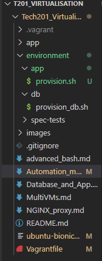
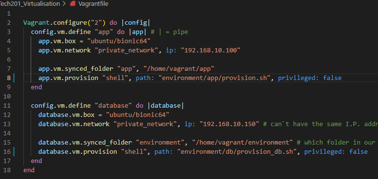

# Automating the creation and configuration of the two VMx `database` and `app`

Let`s automate the configuration of the 2 VMs we created previously. We will break this down into steps as it is good practice as beginner to automate each step of the way, ensure it is working properly, and then automate the next steps. 

### *** Step 1: Create separate provision files for each machine *** 

- As having the provision files for both our machines in the same place can create confusion and blockers in the process, let`s create them separately. 
- Within the `environment` folder, create a `db` subfolder and an `app` subfolder. Within these subfolders, we will have the provision file for each VM. 
- Move the provision file created previosuly for the app, within the `app` subfolder we have just created. 
- For the `database` Vm, we have to create a new one within the `db` subfolder. 
- Your project folder should now look something like this:



## Automating the configuration and communication of the two VMs

!! Ensure that your Vagrant file mentions the fact that both of your VMs now have provision files and mention the path where these can be found.




### *** Step 2: Adding the first provisionig instructions for the `database` VM

- You should now have a provision file for the `database` VM. 
- Within the provision file, let`s first add the instruction of configuring and enabling mongo.db. 
- If you remember the steps we took when we did the mongo.db configuration manually, we now just have to take those commands and add them in the provision file. 
- In my case, I will add in the provision file the instruction to also start and enable mongo.db once the configuration is done (see below).

```
# Setting up mongodb
sudo apt-key adv --keyserver hkp://keyserver.ubuntu.com:80 --recv D68FA50FEA312927

echo "deb https://repo.mongodb.org/apt/ubuntu xenial/mongodb-org/3.2 multiverse" | sudo tee /etc/apt/sources.list.d/mongodb-org-3.2.list

sudo apt-get update -y

sudo apt-get upgrade -y

sudo apt-get install -y mongodb-org=3.2.20 mongodb-org-server=3.2.20 mongodb-org-shell=3.2.20 mongodb-org-mongos=3.2.20 mongodb-org-tools=3.2.20

sudo systemctl start mongod

sudo systemctl enable mongod
```

- If you now do `vagrant ssh database` mongo.db should be running, and you would only have to change the network interface configurations, restart mongo, re-enable it and restart it. It should be active and running if all went well. 

!! Note: Please make sure you follow the rest of the process manually to verify if the automation step worked properly and you can access the `/posts` within the database. 