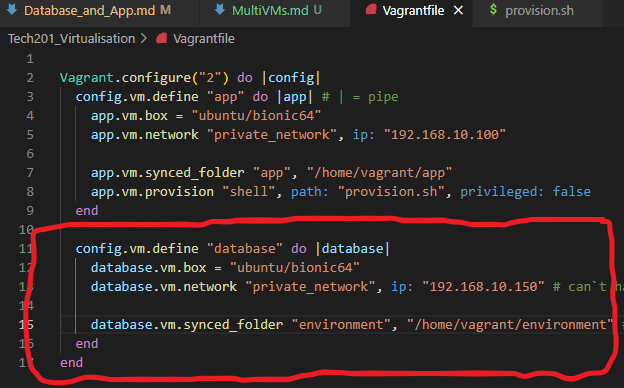
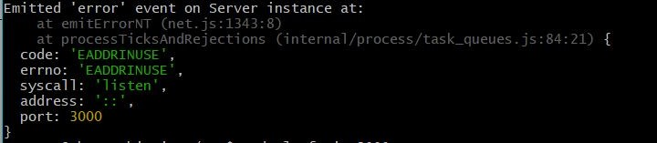

## Setting up and connecting 2 Virtual Machines `database` and `app.

### Pre-requisites:
- A project folder.
- Within the project folder, the **app** and **environment** folders.
- A Vagrant File containing the configuration instructions for our VMs.
- A provision.sh file, containing the intruction to install and set up the required tools and packages within our app.

! **Please Note: Make sure that any instance of VM made with the Vagrant File we will use for this exercise is destroyed using `vagrant destroy`.**

## Let`s get into it!

### Step 1: Update the content of the Vagrant file. 

- Currently, the Vagrant file`s content has intructions to create only one VM, and we need two.



- The lines circled with red are the configuration we need to set up the second VM. As you can see, it specifies that those lines are meant to be instructions for the `database` VM, while the preious lines state that they are for the `app` VM that we made previously.

### Step 2: Updating the provision.sh file
- Firstly, we need to update the line that states the version of `node.js` from `6.x` to `12.x`.

```
curl -sL https://deb.nodesource.com/setup_12.x | sudo -E bash -
```

- We then need to make sure we comment out the instructions to run the app as that can interfere with the process. 

```
#Running the app

#cd app/

#npm install

#node app.js # this starts up the app and makes it run in the foreground in the vm

```
- Now, our provision.sh file should look like this:


### Step 3: Creating our VMs
- In the Bash temrinal in VSC we can create the VMs by using the command `vagrant up`.
- Now, in order to be able to acces them simultaneously, we need two Git Bash terminals: one for the `app` and one for the `database`.
- Open the two separate Git Bash terminals and in one acces the `database` by using `vagrant ssh database`, and in the other one, access the `app` using `vagrant ssh app`.

### Step 4: Setting up the `database` VM

Once inside the `database` VM, we need to install the database.
- First, we need to add a **key** for mongo.db, which is the software that we us to create the database:
```
sudo apt-key adv --keyserver hkp://keyserver.ubuntu.com:80 --recv D68FA50FEA312927
```
This will output a confirmation of import.

- Then, we need to make sure the key worked:
```
echo "deb https://repo.mongodb.org/apt/ubuntu xenial/mongodb-org/3.2 multiverse" | sudo tee /etc/apt/sources.list.d/mongodb-org-3.2.list
```
As a confirmation, it will output ` deb https://repo.mongodb.org/apt/ubuntu xenial/mongodb-org/3.2 multiverse`.

- Now, let`s update and upgrade the entire system:
```
sudo apt-get update -y
sudo apt-get upgrade -y
```

- Lastly, let`s install the database:
```
sudo apt-get install -y mongodb-org=3.2.20 mongodb-org-server=3.2.20 mongodb-org-shell=3.2.20 mongodb-org-mongos=3.2.20 mongodb-org-tools=3.2.20
```

- We need to make sure that the database is working by using the following:
```
sudo systemctl start mongod
sudo systemctl enable mongod
```
When we get a confirmation of a `symlink` being created we can proceed.

- After the installation went through, we have to change the default network configuration of mongo.db by accessing the config file through `nano /etc/mongod.conf`.
```
# default network interfaces
net:
 port: 27017
 bindIp: 127.0.0.1 
 
# Change it to 0.0.0.0 which means allow access to everyone.

# our network interfaces
net:
 port: 27017
 bindIp: 0.0.0.0 
```

- Once we did these changes, we have to restart mongo.db to make sure it takes in these changes we just made:
```
 sudo systemctl restart mongod
 sudo systemctl enable mongod
  sudo systemctl status mongod
```
The last command will prompt the status of mongo.db, which should be active.


Use `Ctrl` + `C` to get out of the VM and use `vagrant ssh database` to access it again.

### Step 5: Setting up the `app` VM

- First, let`s check that our tools (that must be installed through provisioning) are installed correctly:
```
nginx -v

node -v
```

- Now, we have to create the Environment Varible, which will the ur `app` that everytime it needs to access a database, it can do that by accessing the `database` we just created.

```
 export DB_HOST=mongodb://192.168.10.150:27017/posts # contains the instructions of where to access the database.
# we can persist the environment variable in `.bashrc` if needed.
 printenv DB_HOST # to make sure we set it up properly.

```

- Lastly, let`s make sure that our app is communicating with the database:
```
cd app/ # to make sure we are in the right place to install and start up the app.

npm install # to install the app. it will output `node seeds/seed.js` - which we will run again, even if the system runs it for us, just to make sure the database has been populated.

node seeds/seed.js # should ouput `[...] Database Cleared Database Seeded`, which is our confirmation that the database has been populated.

node app.js # which should ouput `Your app is ready and listening on port 3000`

```

### Step 6: Check if the app is running correctly and is able to communicate with the database

- Go to your browser and type in the app I.P. address with the port where the app is listening and mentioning what to access from the database:

 `192.168.10.100:3000/ports`

 - If everything went well, you should see: 

 

 !! Note: If you get the following error when trying to start up the app with `node app.js`:

 


- Print the current processes that use the port number of your app by using `sudo lsof -i :3000`.
- Then, kill the procees with `kill -9 + PID of the process that showed up as using port 3000`.
- Now, run again `node app.js` and it should tell you that your app is listening on port 3000, and you should be able to access the app on your browser.