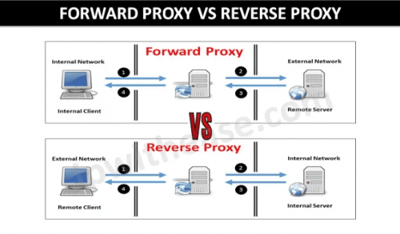
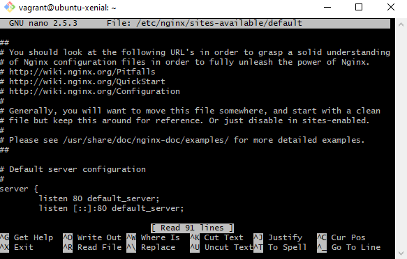
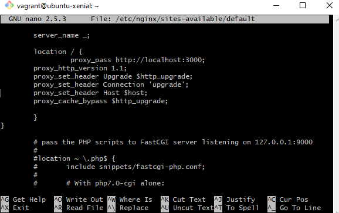
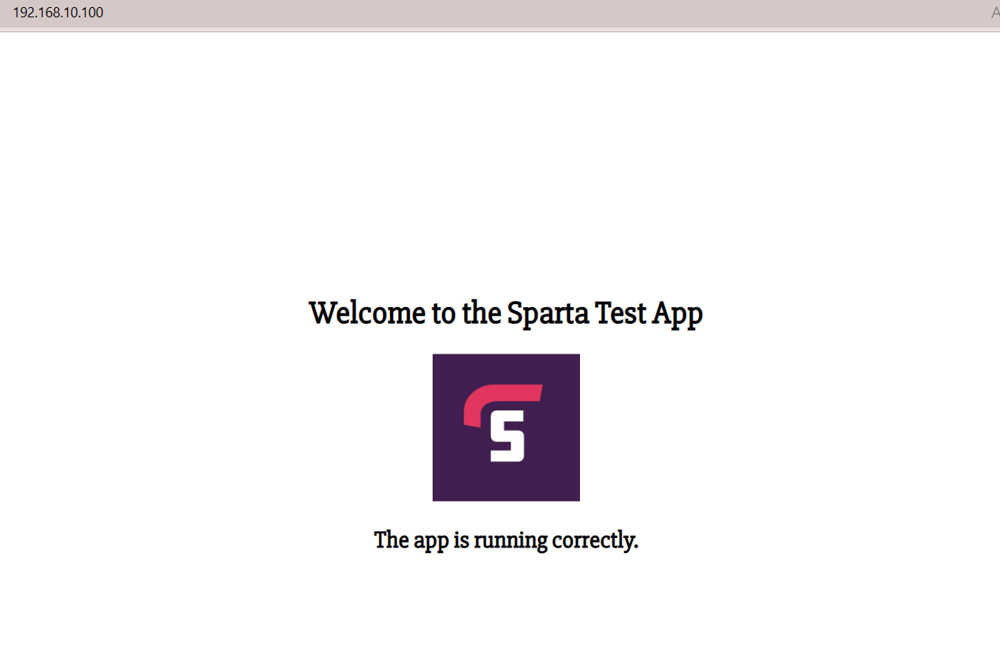

# NGINX Proxy and Reverse Proxy

- In order to understand why and how to set up a reverse proxy, we first need to understand what PORTS are. Let`s get into it:

## Ports
***What is a port?***

- A port is a **virtual point** where **network connections start and end**. 
- Ports are software-based and **managed by a computer's operating system**. 
- **Each port is associated with a specific process or service**. 
- Ports allow computers to easily differentiate between different kinds of traffic: emails go to a different port than webpages, for instance, even though both reach a computer over the same Internet connection.

***What is a Port number?***

- Ports are **standardized across all network-connected devices**, with **each port assigned a number**. 
- Most ports are reserved for certain protocols — for example, *all Hypertext Transfer Protocol (HTTP) messages go to port 80*. 
- While *IP addresses enable messages to go to and from specific devices*, **port numbers allow targeting of specific services or applications within those devices**.

***Port Numbers***

There are **65,535 possible port numbers*, although not all are in common use. Some of the most commonly used ports, along with their associated networking protocol, are:

- **Ports 20 and 21: File Transfer Protocol (FTP)**. *FTP is for transferring files between a client and a server*.
- **Port 22: Secure Shell (SSH)**. *SSH is one of many tunneling protocols that create secure network connections*.
- **Port 25: Historically, Simple Mail Transfer Protocol (SMTP)**. *SMTP is used for email*.
- **Port 53: Domain Name System (DNS)**. *DNS is an essential process for the modern Internet; it matches human-readable domain names to machine-readable IP addresses, enabling users to load websites and applications without memorizing a long list of IP addresses*.
- **Port 80: Hypertext Transfer Protocol (HTTP)**. *HTTP is the protocol that makes the World Wide Web possible*.
- **Port 123: Network Time Protocol (NTP)**. *NTP allows computer clocks to sync with each other, a process that is essential for encryption*.
- **Port 179: Border Gateway Protocol (BGP)**. *BGP is essential for establishing efficient routes between the large networks that make up the Internet (these large networks are called autonomous systems)*. Autonomous systems use BGP to broadcast which IP addresses they control.
- **Port 443: HTTP Secure (HTTPS)**. *HTTPS is the secure and encrypted version of HTTP. All HTTPS web traffic goes to port 443*. Network services that use HTTPS for encryption, such as DNS over HTTPS, also connect at this port.
- **Port 500: Internet Security Association and Key Management Protocol (ISAKMP)**, which is part of the process of *setting up secure IPsec connections*.
- **Port 587: Modern, secure SMTP that uses encryption**.
- **Port 3389: Remote Desktop Protocol (RDP)**. *RDP enables users to remotely connect to their desktop computers from another device*.

The **Internet Assigned Numbers Authority (IANA)** maintains the full list of port numbers and protocols assigned to them.

## Proxy vs Reverse Proxy
### Proxy
 A **proxy server is one of the tools that help protect a network and the assets that are connected to it**. They make sure *users, data packets and computers are safe and can communicate effectively*.
 - Proxy servers can be software solutions (on-premises or cloud proxy) or a hardware device sitting on the network. 
 - They are meant to cater, or offer their services, to users sitting behind them and connected on a local network.
- The main tasks of a proxy server include:

1. Regulating traffic as per set policies
2. Masking outwards facing clients’ IP addresses (as packets go out)
3. Converting IP addresses to the internal network’s addresses (as packets come in)
4. Enforcing protocols
5. Blocking suspicious or unknown traffic

### Reverse Proxy

**Reverse Proxy is a type of proxy server that is used to protect the servers on its network from external users**.

As the name suggests the Reverse proxy does the exact opposite of what the forward proxy does.  This proxy accepts incoming requests addressed to one of its servers, forwards the request to the server – if it is allowed – and returns the results or response from the server to the client as if it had processed the request itself.

The client, on the other hand, only communicates with the reverse proxy server and doesn’t know that it is another server, behind the reverse proxy, that is addressing the query or processing the request.

An Internet based attacker would find it very difficult to acquire data found in a shared server than if they didn’t have to deal with the reverse proxy server in front of it.

Just like forward proxy servers, reverse proxy servers also provide a single point of access and control. They are typically set up to work alongside one or two firewalls to control traffic and requests directed to internal servers.

## When should you use Proxy and when should you use Reverse Proxy

- Forward proxy communicates on behalf of clients (or requesting hosts). 
- Meanwhile, a reverse proxy communicates on behalf of servers. A reverse proxy server accepts requests from external clients on behalf of shared servers that are stationed behind it.
- This means: a forward proxy hides the identities of clients, while a reverse proxy hides the identities of servers.

### ***Forward proxy – to protect the users***
Benefits:
- There is a need to protect users or groups of users on a network.
- Anonymity is required to make sure no client can be targeted because their IP address has been exposed.
- All users must be protected or prohibited from accessing harmful sites, malicious content or any data that contradicts set policies.
- Access Control is required over the content and packets that are allowed into or out of the network.
- A central point of control is required instead of having to roll out configurations and policies to individual endpoints.

### ***Reverse proxy – to protect servers***
Benefits:
- There is a need to protect servers from external users.
- Anonymity is required to mask the servers so hackers or other malicious users can target them by targeting their exposed IP addresses.
- Servers must be protected from packets and traffic that could prevent them from functioning efficiently – or even make them crash. Examples include Denial-of-Service (DoS) attacks.
- Control is needed on who can access resources shared on servers.
- A central gateway is required to manage traffic policies, instead of having to configure each server individually.
- A point that needs to be made here is that a proxy and a reverse proxy are not mutually exclusive – they can both be implemented in a single network. One protects the clients and the other covers the servers.

## What is NGINX Default config?

` 
You should look at the following URL's in order to grasp a solid understanding
of Nginx configuration files in order to fully unleash the power of Nginx.
http://wiki.nginx.org/Pitfalls
http://wiki.nginx.org/QuickStart
http://wiki.nginx.org/Configuration

Generally, you will want to move this file somewhere, and start with a clean
file but keep this around for reference. Or just disable in sites-enabled.

Please see /usr/share/doc/nginx-doc/examples/ for more detailed examples.

***Default server configuration***

server {
        listen 80 default_server;
        listen [::]:80 default_server;
        }
`

## Setting up NGINX Reverse Proxy for our Sparta Test App.

1. First, access your VM by typing in terminal the `vagrant up`(to get it running) and `vagrant ssh`(to get inside the VM) commands.
2. Now, within your VM, run the command `sudo nano /etc/nginx/sites-available/default`. This will open up the default configuration file for NGINX and allow you to make the necessary changes. This file should look like this:

3. Within this file we have to make some changes in the `location /` section.
We will simply have to replace the current configuration with the following:
`
 proxy_pass http://localhost:8080;
        proxy_http_version 1.1;
        proxy_set_header Upgrade $http_upgrade;
        proxy_set_header Connection 'upgrade';
        proxy_set_header Host $host;
        proxy_cache_bypass $http_upgrade;
`

!!! Always make sure on which port your app is listening, as that needs to be the port you mention at `http://lovalhost:`. In my case, I will have to change that to 3000 as that is the port that my app is listening on.  

4. Once you did the necessary changes, let`s make sure that we didn`t make any mistake by typing in `sudo nginx -t`. 
5. To set up these changes, we have to restart nginx by using `sudo systemctl restart nginx`.
6. Now, we should be able to have everything in place, and access our app by using only the I.P. address, so without having to mention every single time the port number. Type the I.P. address in your web browser, same way we normally check if nginx is up and running. And......

Happy Days! Now our app can be accessed simply by using the I.P. address in the browser. 

