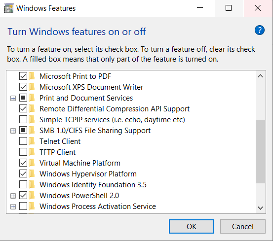

# DevOps and Development Environments

## DevOps

### Cloud 
Data centres at Google :

- best information security system; use various layers of security and each uses different security technologies; 
- run their data centres with strong cooling systems to ensure perfect conditions that reduce failure risk or servers;
-  innovative = always try to find ways of innovating their data centres and their technologies. 

Before cloud = physical storage on premises.

After cloud = we are storing our data in data centres of a cloud service provider.

### What kind of problems are devOps engineers looking to solve?

- **Ease of use** = Other team are going to use the tools we create. They will not use them if they aren`t user-friendly. If they refuse to use our tools and choose to either use their own tools or develop their own tools, there will be delays in deployment down the line due to descrepancies between technologies used.

- **Flexibility** = Software, tools, and everything re. IT is move at an incredible place. If you`re locked into using a certain product/tool/software, you might find it difficult to keep up with industry changes. As devOps Engineers, we must make sure that everything a company uses can be easily changed or updated as the business needs change.

- **Robustness** = As devOps Engineer, we are responsible to ensure that as soon as the product is developed, tested and released, it stays alive, that they are robust (have as much uptime as possible). We need as close to 100% uptime as possible for our company`s services.

- **Cost** = Technology costs money and costs are often overlooked. It is our job to ensure that everything that the company is using is as cost-efficient as possible. We do that by assessing how powerful the tools we need must be, if we necessarily need certain servers running at all times, etc.

### Architecures

- We start with a **Monolith** = everything you need to run an app (storage, etc) resides on the same physical machine.
- We can have 2-Tier architecture.
- Microservices (containers).

### Risk register:

- Highlights certain areas of risks within a project, containing: description of risk, chance of the risk occuring, potential damage to the company if the risk occurs, and level of risk.

## Development Environments

- Place where developers should be able to write, run and test programs.

- The way to think about development environment = a space on a machine that has all the necessary tools to write, run, and test the code for a program. 
- We, as DevOps engineers, create the development environments because we can standardize things (everyone works on the same environment, system, everything runs the same for everyone, etc.)

### What makes a good Development Environment?
- Usser friendly, fast and robust. 
- It should be easy to update and change for us.
- Compatibility = it should match the production environment (where it is used by users) as closely as possible. 
- Consistency - it should be the same for everyone, everywhere (should run the same on each machine, with the same tools, etc.).
- It should only support one application. 
            
e.g. :      
- App 1 requires version 1.1 and App 2 requires version 1.4.
- App 1 needs a particular program that conflicts with a program that conflicts with App2.

Virtualisation - creating a basic development environment:

**Installing Ruby:**
- https://rubyinstaller.org/downloads/
- Pick the highlighted version usually.
- Run it, install it (usually without the toolchain).
- Check the version of Ruby by going into Git bash terminal and checking "ruby --version".

**Installing Virtual Box:**
- https://www.virtualbox.org/wiki/Download_Old_Builds_6_1
- Pick the 6.1.42 version, rather than the newest version, as the new ones tend to have certain unnecessary additions that may interfere with your tasks.
- Run it and install it.
- It will ask you to restart after the installation finished, just so the program can set everything in place.
- Now, in order to ensure that you can use virtualisation, we need to check some Windoes Features.
- Make sure you have Windows Hyperviser Platform, and Virtual Machine Platform.

- If you also have Hyper-V, please untick it. 

*** [Clear instruction on setting up Ruby, Virtual Box and Vagrant](https://github.com/khanmaster/vb_vagrant_installtion) ***

### Vagrant Install:
- 

- In git bash get in the directory lnicked to github and afer you are on main branch:

 `vagrant init(initializes a new environment in this folder) ubuntu(os)/xenial64(distribution of os) + Enter.` 

