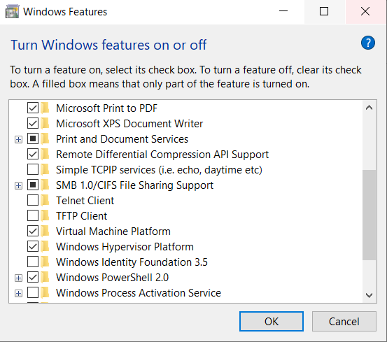
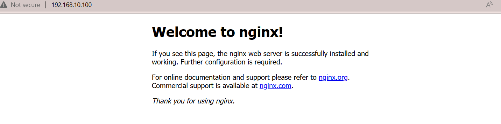
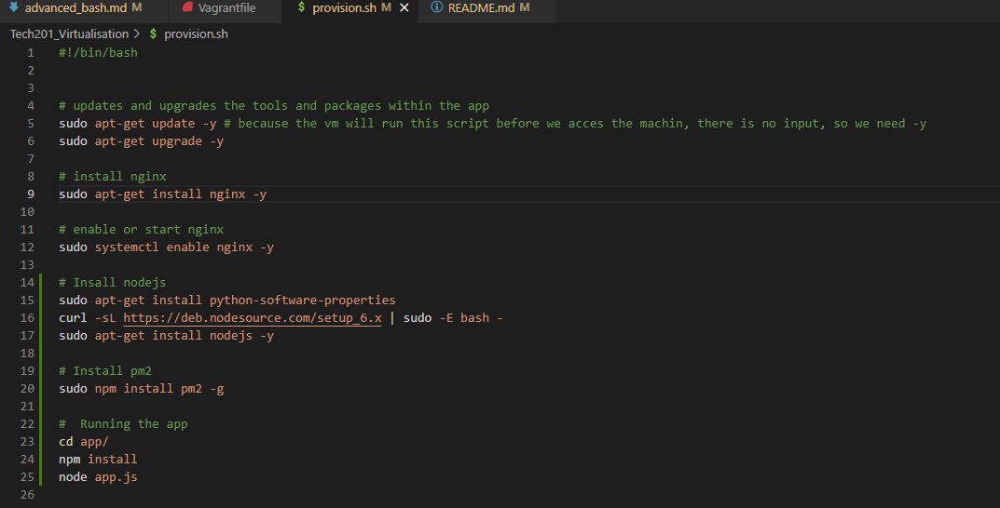
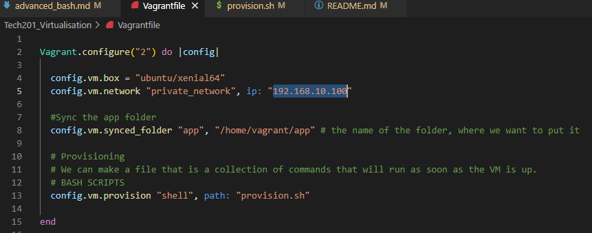
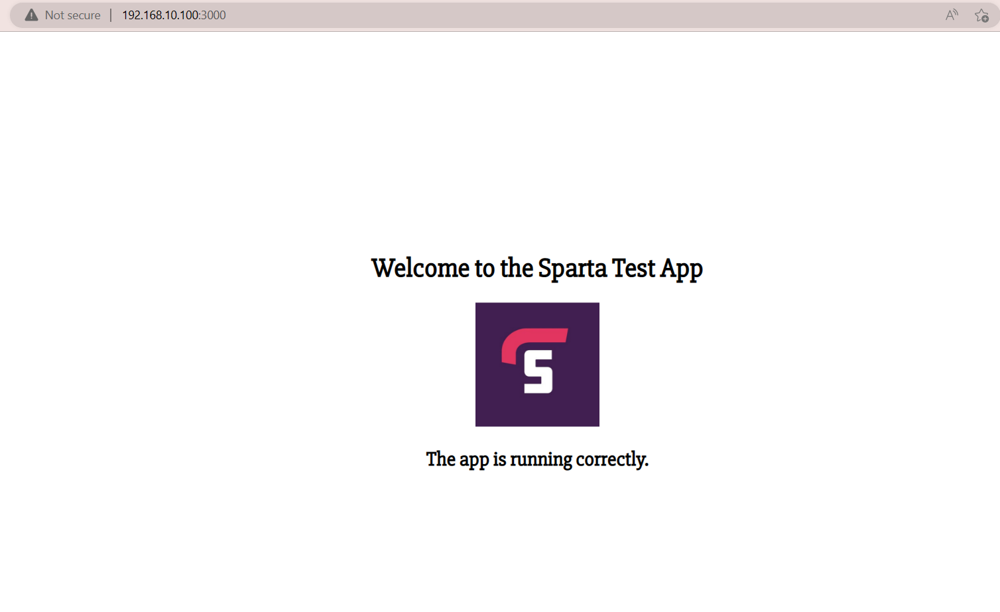
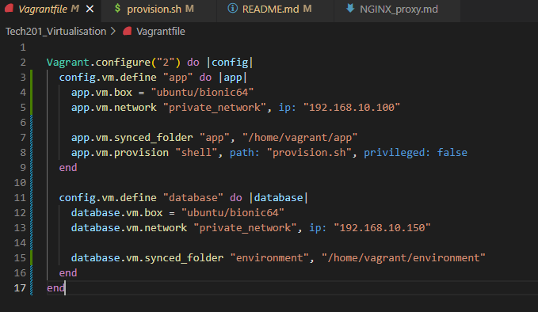
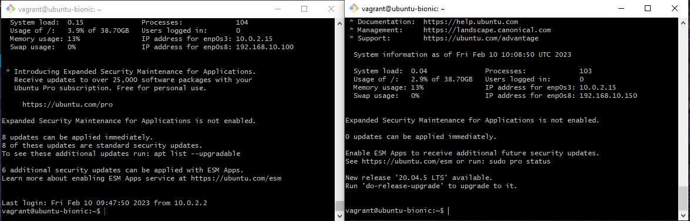

# DevOps and Development Environments
# Adding changes via Git BASH to test connection with Jenkins
## DevOps

### Cloud 
Data centres at Google :

- best information security system; use various layers of security and each uses different security technologies; 
- run their data centres with strong cooling systems to ensure perfect conditions that reduce failure risk or servers;
-  innovative = always try to find ways of innovating their data centres and their technologies. 

Before cloud = physical storage on premises.

After cloud = we are storing our data in data centres of a cloud service provider.

### What kind of problems are devOps engineers looking to solve?

- **Ease of use** = Other team are going to use the tools we create. They will not use them if they aren`t user-friendly. If they refuse to use our tools and choose to either use their own tools or develop their own tools, there will be delays in deployment down the line due to descrepancies between technologies used.

- **Flexibility** = Software, tools, and everything re. IT is move at an incredible place. If you`re locked into using a certain product/tool/software, you might find it difficult to keep up with industry changes. As devOps Engineers, we must make sure that everything a company uses can be easily changed or updated as the business needs change.

- **Robustness** = As devOps Engineer, we are responsible to ensure that as soon as the product is developed, tested and released, it stays alive, that they are robust (have as much uptime as possible). We need as close to 100% uptime as possible for our company`s services.

- **Cost** = Technology costs money and costs are often overlooked. It is our job to ensure that everything that the company is using is as cost-efficient as possible. We do that by assessing how powerful the tools we need must be, if we necessarily need certain servers running at all times, etc.

### Architecures

- We start with a **Monolith** = everything you need to run an app (storage, etc) resides on the same physical machine.
- We can have 2-Tier architecture.
- Microservices (containers).

### Risk register:

- Highlights certain areas of risks within a project, containing: description of risk, chance of the risk occuring, potential damage to the company if the risk occurs, and level of risk.

## Development Environments

- Place where developers should be able to write, run and test programs.

- The way to think about development environment = a space on a machine that has all the necessary tools to write, run, and test the code for a program. 
- We, as DevOps engineers, create the development environments because we can standardize things (everyone works on the same environment, system, everything runs the same for everyone, etc.)

### What makes a good Development Environment?
- Usser friendly, fast and robust. 
- It should be easy to update and change for us.
- Compatibility = it should match the production environment (where it is used by users) as closely as possible. 
- Consistency - it should be the same for everyone, everywhere (should run the same on each machine, with the same tools, etc.).
- It should only support one application. 
            
e.g. :      
- App 1 requires version 1.1 and App 2 requires version 1.4.
- App 1 needs a particular program that conflicts with a program that conflicts with App2.

Virtualisation - creating a basic development environment:

**Installing Ruby:**
- https://rubyinstaller.org/downloads/
- Pick the highlighted version usually.
- Run it, install it (usually without the toolchain).
- Check the version of Ruby by going into Git bash terminal and checking "ruby --version".

**Installing Virtual Box:**
- https://www.virtualbox.org/wiki/Download_Old_Builds_6_1
- Pick the 6.1.42 version, rather than the newest version, as the new ones tend to have certain unnecessary additions that may interfere with your tasks.
- Run it and install it.
- It will ask you to restart after the installation finished, just so the program can set everything in place.
- Now, in order to ensure that you can use virtualisation, we need to check some Windoes Features.
- Make sure you have Windows Hyperviser Platform, and Virtual Machine Platform.

- If you also have Hyper-V, please untick it. 

*** [Clear instruction on setting up Ruby, Virtual Box and Vagrant](https://github.com/khanmaster/vb_vagrant_installtion) ***

### Vagrant Install:

- In git bash, get in the directory lincked to github and afer you are on main branch:

 `vagrant init(initializes a new environment in this folder) ubuntu(os)/xenial64(distribution of os) + Enter.` 

### Creating a Virtual Environments
- Open GitBash.
- Using `cd`, get in the directory tracked by Git.
- Use `ls` to make sure you are in the correct place. 
- Once you are in the correct directory, follow the next commands:
- `vagrant init`(init = initializes the file with instructions that will be sent to the software that will create the virtual machine) `OS/distribution of OS` (e.g. ubuntu/xenial64).
- In your directory, you should notice a Vagrantfile being created.
Go in the Vagrant file and delete all the comments. Keep only the 3 lines of code necessary to execute the instructions. 
- Now, let`s get vagrant to give the instructions file to Virtual Box or whatever software for virtual machines you have installed. 
- `vagrat up` - will create the virtual machine. 
- To see if all went well, open the Virtual machine software, and watch the machine being created. 
- Now, our machine should be up and running.
- Lastly, how can we access our virtual machine?  Because, as we can see in the Virtual Machine software (in my case, Virtual Box), it is just a terminal in there. We cannot really access it.
- We access it through `vagrant ssh` (ssh - how we connect to things securely).
- To be sure you are inside the VM, you should have the following :

- Checking that you are in the correct place within the VM is done with `ls -a`. In my case, due to my choice of OS and ditribution, I need to see this `.  ..  .bash_logout  .bashrc  .cache  .profile  .ssh` , which will confirm me that I am within the VM.
- Within the VM, we want to be able to use a web browse. Usually the choice will be either Apache or nginx. We are going to set up the VM with nginx. 
- Commands to install nginx:
- `sudo apt-get update -y`
- `sudo apt -get install nginx -y`
- `sudo systemctl start nginx`
- `sudo systemctl status nginx` (should show active: running)

- Let`s now view the app. Vagrant assigns a new I.P address to the VM everytime it is started up. So, we can change the I.P. address.
- In the Vagrantfile, below the line of code that states the configurations of your VM in terms of OS (e.g. in my case it will be `config.vm.box = "ubuntu/xenial64"` ), add the following:
- `config.vm.network "private_network", ip: "192.168.10.100"`
- Go back to gitbash and exit the VM, by using the command `exit`. If `exit` does not work, use `Ctrl + C`. 
- Now, we will tell the system about the change in I.P. that we just made, by using the command `vagrant reload` - will reboot the VM with the new settings. 
- Feel free to access the VM by typing the I.P. address in your browser. :) 

## Provisioning
- Think of provisioning as a set of instructions sent to the virtualisation software that will configure the VM in the way that we want. 
- Remember in our Vagrant file, we specified that we want the machine to have a certain OS, a certain distribution of the OS, we wanted to assign it a specific I.P. address and we wanted it to import a folder named `app` that can be found in our project folder.
- Now, with Provisioning, instead of having to get into the VM to install and enable every single tool that we need, we can have a file that contains all the instructions on how to install and enable those tools, and the sistem can follow those instructions alone, without us having to get into the machine and doing it manually.
- Create a `provision.sh` file containing BASH scipts for updating, installing and enabling necessary tools and packages (in our case, nginx, nodejs and pm2).

!! Note: 
- `node.js` = allows developers to write code that runs on the server, rather than in a browser. This allows for the creation of things like web servers, chat applications, and other types of real-time applications that can handle a large number of connections and perform tasks quickly.
- `npm` = Node Package Manager, and it's a package manager for the Node.js platform. A package manager is a tool that helps you manage the software and libraries that your application depends on.

- Now, in your Vagrant file, add the intructions written in the provision file, by typing `config.vm.provision "shell", path: "provision.sh"`. This will basically the tell the software that creates the VM to use these instructions when it runs the VM.

- If you now go in the terminal in the folder where you have the project, and input `vagrant up`(only if you do not already have a VM running - in which case, simply use `<vagrant reload --provision.>`), your machine should start running the VM and you should be able to see if the instructions you provided are being configured as instructed. 

- You can easily check if the VM configured properly by trying to access the I.P. address you assigned the VM in your browser, alongside the port on which the app is listening(prompted in the terminal if all the provisioning has been correctly configured). If you see the following: 

 Happy Days! You app is up and running due to a correct execution of the provisioning instructions.

- Want to find out how to set up a reverse proxy for our app? Please, check out the NGINX_proxy.md.  

## Creating 2 VMs with the same Vagrant file.

- You can use a Vagrant file to create multiple VMs at the same time.
- All it takes is setting up the file so the instructions clearly state how many VMs you want to create and their specific configuration.
- In my case, with one Vagrant file I am going to be able to create an app and a database:

- As you can see, as I mentioned earlier, the Vagrant file is going to send this file to the software that creates the VMs and ell it to create 2 VMX and configure them: one as an app(just like we did yesterday, while also including separate tools and packages installation instructions via provision.sh) and the second one as a database. 

!!! Make sure you remove any Vagrant file ou might have in your project folder before setting it up with a new one, otherwise you will encounter errors. 

- Now that the Vagrant file with the instructions for two VMs is in place, we just need to make sure we run the command `vagrant up` to make sure the Vagrant file sends the instructions and the software that creates the VMs undeerstands that it needs to create them both at once. 
- You can access the two machines separately by using two separate GIt Bash terminals, and using the commands (in my case) `vagrant ssh app` and `vagrant ssh database`. In a different case it will be a matter of how you instructed Vagrant in the Vagrant file to configure the VMs as. 

- If you want to see how to interconnect the 2 VMs, have a look at MultiVMS.md file. :)

