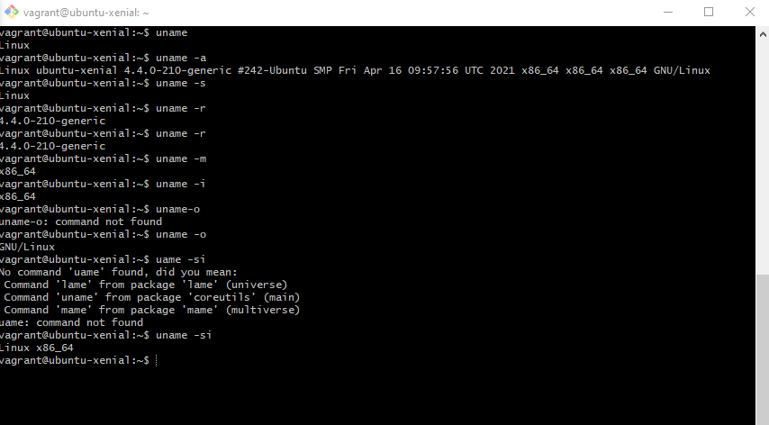
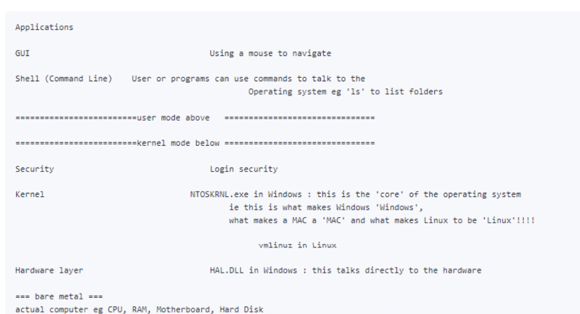
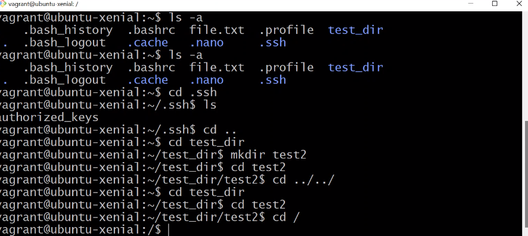
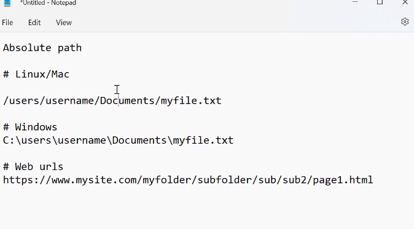
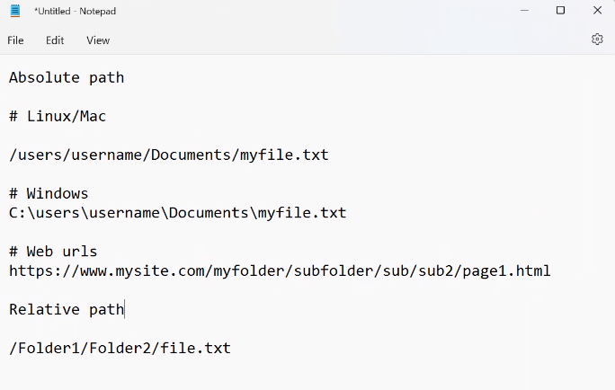
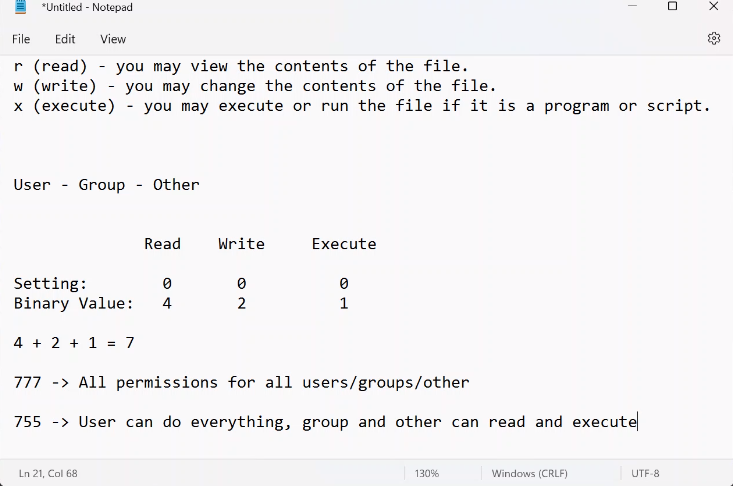
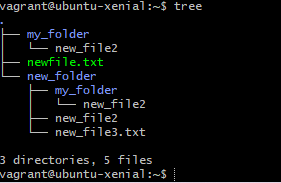

# Linux Commands

 - To perform these, please make sure you are within the VM in Git Bash, by typing the command `vagrant ssh`.
 

 1. `uname` = system info - returns OS(kernel)

 ** flag = what we put after a command, to make it more specific
-  `uname -a` (-> -a = flag(short for --all)) = this command outputs all the details about the system, not only the OS name. 
- `uname -s` = same as uname itself
- `uname -r` = release date for os
** we can also combine flags :
- `uname -si` 
- `uname -srp`

2. Navigation (as we don`t have a GUI, and we are only accessing the shell, we cannot use the mouse, so you only use commands):
 
** So, at the moment we are below the GUI, in the Shell, communicating with the Kernel through command line. And we navigate through the Kernel(the place below, generally speaking the OS of the machine) by using commands. 
- `cd` - change directory 
- `cd ..` - takes you back one level
- `cd ../..` - takes you back two level
- `cd /`- (takes you to the root directory)
- `cd ~` - (takes you to the home directory)

- `ls -l` - 'long format' tells you the permissions for the files within the folder.
** accessing files and folders:
- absolute path:
** from the absolute base of the machine

- relative path:
** from where I am right now

3. Creating folders:
- `touch` - creating files of any kind - but empty files.
- `nano +filename.filetype` - opens the file with the name you provided, and you can edit the file.  (exiting: `Ctrl +x` + `y` + `Enter`)
- `cat +filename.filetype` - presents the content of the file; concatenates it. 
- `mkdir + name of folder` - make directory

4. Copying files:
- `cp +namefile.filetype nameofnewfile.filetype` - copies the content of a file.
- `cp filename.filetype directory/nameofcopiedfile.filetype` - copies the content of a file into a new file within a specified folder. 
** copying folders:
- `cp -rf my_folder new_folder` - rf = recursive(to the action on the folder and everything inside), force(do it even if the file is locked or is being used) - in the format of : cp -rf "the folder you want to copy"  "the name of the new folder where you want to copy the previously mentioned folder". 
- `rsync -r nameofthefirstfolder nameofthenewfolder` - syncs the folders 

5. Moving files:
- `mv thefileyouwanttomove.filetype thefolderyouwantoputitinto/` - move a file ina folder; the towards back you want to go add `../../../`
- `mv fileyouwanttomove.filetype fileyouwanttomove**rename**.filetype`  - renames a file.

6. Deleting files:
- `rm -rf` - no chek, it will just remove it.
- `rm -rf nameoffile.filetype`
- `rm -rf foldername`
- `rm -rf` - can potentially delete your whole Linux environment.
earching for smthn:
- `grep wordtobefound filenamewhereyouarechecking.filetype`
- `grep wordtobefound *` - prints all the places where you can find that word.
- `grep wordtobefound * -R` - recursive look-up = check everything inside of folders within folders etc. 

7. Wild cards:
- allow us to use characters we use in our files and folders names so we can easily access them.
- `ls file*` - will return me all the files and folders that begin with "file".

** Help instructions:
!!! command --help = will output you details about the command
!! man ls = user manual for Lnux terminal
!! man -k word = prints you all the command containing the (word) keyword.

8. Permissions:
- `ls -l` - showcases the permissions.
**e.g. ne of my files has "drwxrwxr"
- `r` - stands for read - someone has permission to read the file.
- `w` - stands for wite - permission to make changes to the file.
- `x` - stands for execution - they can execute a file. i.e. a .py file, if you have execution permission it means that you can run the program wrote in the file. 
** Having them written multiple times means:
- 1st `rwx` - owner
- 2nd `rwx` - part of the ownership group
- `r` - everyone else/others/all

** setting permissions:
- checking the file permission first - `ls -l nameoffile.filetype`
- changing permissions- `sudo chmod u+x(u = user or owner/ g = group / o = others ; + to add/ - to remove permissions, x(or r or w))` = ch(change file) + mod(mod bit=permissions)
- changing permissions for everyone at once - `sudo chmod 777 filename.filetype`
- numbers for changing permissions : 4 = read, 2 = read, 1 = execute. 

[Chmod calculator](https://chmod-calculator.com/)

9. Process management (similar to task manager on Windows):
- `top` = real time statistics, and also locks you out of the terminal (not recommended, as it actually locks you out of terminal and it can actually create difficulty when attempting to get back in the terminal within the VM).
- use `Ctrl + C` to get out.
- the better way of checking what is working, use `ps` = shows current processes used in the terminal .
- `ps aux` = print out of all the systems running in  the background. 
** Killing processes:
- create a random process `sleep 120(time you want it to run for) &(& - makes it run in the background)` - will return a number in eg in my case[1]1955.
- to kill `sleep` use `kill -9 and the PID(in this case 1955).
- after you kill something with `kill -9`, if you type `ps` it will show `sleep` as Killed. 
- `Ctrl + Z` - stops a program
- `fg` - foreground( brings it back to the foreground from the background)

10. Tree:
- showcases all the folders in our device (more visual way of seeing files and folders.)
- must be installed, so run:
1.  `sudo apt-get update`
2.  `sudo apt install tree -y`
- now trype `tree` and you should see the files in your VM as follows:

